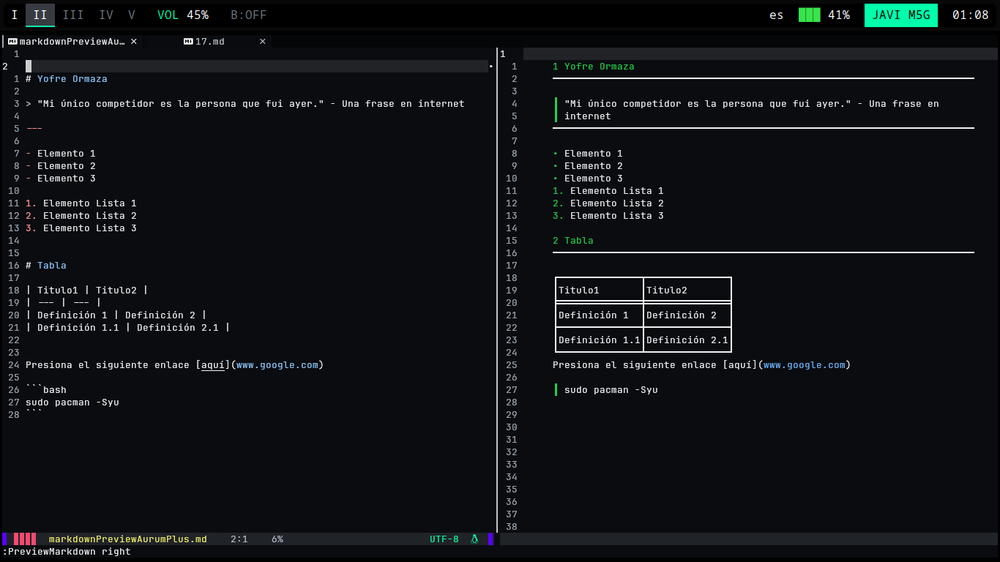

## 🛠️ AurumPlus se encuentra en desarrollo


---

### Crear un proyecto C++ desde AurumPlus

- [¿Como clonar este repositorio?]()
- [Requisitos](#requisitos)
- [Requisitos para markdown preview desde neovim](#requisitos-para-markdown-preview)
- [¿Como activar WakaTime para estadísticas personales de codificación?](#activar-wakatime)
- [Bug Fixes (Lista de Errores Solucionados)](/GuideForErrors.md/)

### Requisitos

#### 1. Instalar cmake

```jsx
sudo apt install cmake
```

#### 2. Instalar Packer

1. Buscar Packer nvim en google y clonar el repositorio para instalación y uso.

#### 3. Instalar g++

```bash
sudo apt install g++-12
```

#### 4. Instalar nodejs y npm

#### 5. Instalar [code-minimap](https://github.com/wfxr/code-minimap)

Es necesario para que el minimapa del IDE se pueda visualizar


---

### Crear el proyecto C++

1. Crear la carpeta del proyecto
2. Crear el archivo CMakeLists.txt y modificar el número de versión de cmake (En caso de necesitarlo)
    
    ```bash
    nvim CMakeLists.txt
    ```
    
3. Crear el archivo main.cpp

### Compilar y ejecutar el programa

Una vez haya creado su programa es necesario compilarlo.

1. Crear el sistema make en modo comando desde AurumPlus mediante **:Generate**  
2. Construir el proyecto en modo comando desde AurumPlus mediante **:Build**
3. Abrir la terminal interna de AurumPlus con el mapeo `Control+j` , dirigirse a la carpeta /out/Debug/ y ejecutar el programa
    
    ```bash
    ./nombreDelPrograma
    ```

---

### Requisitos para markdown preview

Preview



#### 1. Instalar mdr

En el caso de **Arch Linux** el paquete se encuentra en este [repositorio AUR](https://aur.archlinux.org/packages/mdr)

#### 2. Uso

El mapeo corresponde a `Control + i` (en modo normal) para activar el preview del archivo markdown

---

### Activar WakaTime

[Wakatime](https://wakatime.com) es un servicio u herramienta útil que rastrea automáticamente todo tipo de métricas personales durante el tiempo de programación.

Para activar este complemento solo basta con:

1. Dirigirse hacia el archivo /lua/plugins.lua y descomentar la línea que indica el uso de wakatime.

2. Actualizar/Instalar el plugin con el mapeo `PP` o `PU` para que WakaTime sea instalado. 

---

### Instalación

#### Clona este repositorio

```bash
git clone --depth 1 https://github.com/yofreOrmaza/AurumPlus ~/.config/nvim
nvim
```
